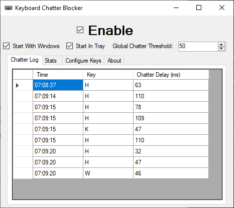
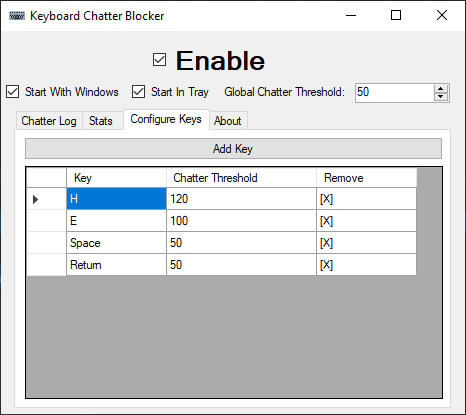

Keyboard Chatter Blocker
------------------------

Keyboard chatter blocker is a quick handy tool to block mechanical keyboard chatter on Windows PCs.

Click [here](#setup) for the steps to get it running.

Talk to us on Discord @ https://discord.gg/eggWVJt

---

1. [Why This Exists / What It Is](#the-problem)
1. [Screenshots](#screenshots)
1. [Requirements](#requirements)
1. [Setup](#setup)
1. [Perfecting Your Settings](#perfecting-your-settings)
1. [General Notes](#general-notes)
1. [Raw Config File Editing Notes](#config-file-notes)
1. [Other Features](#other-features)
1. [License](#licensing-pre-note)

## The Problem

Mechanical keyboards sometimes have a problem known as "chatter", wherein certain keys will seem to repeat keystrokes two or more times very rapidly when only pressed once.

## The Existing Solutions

So solution number one is obvious: just replace the broken key switch (or the entire keyboard).

Solution number two is: Well, there are existing software solutions, that block very rapidly repeated keystrokes to fix the chatter problem. I've been using "Keyboard Chattering Fix v 0.0.1", Copyright in 2014 to the "Keyboard Chattering Fix Project"... I can't find an appropriate source link for this project, likely it was just a one-off creation in 2014 without updates and there's not much more to it. I've also come across "Keyboard Unchatter" by ZoserLock here on GitHub at [ZoserLock/keyboard-unchatter](https://github.com/ZoserLock/keyboard-unchatter).

## The Limitations of The Existing Solutions

Replacing keyboard switches or entire keyboards, of course, can be difficult to do and tends to cost money. A software solution may be preferrable to many people.

 Both of the mentioned software projects projects seem quite... decent, but they lack some critical functionality. In my case, the "h" key has a chatter problem (when I type "the", it types "theh"). The chatter is in the 100ms range... and I really don't want to block *all* keystrokes under 100ms (I'm a fast typer). Unfortunately, these existing options don't have a solution for me... so, instead, I've made a solution that fits my case and present it here to the public. (Also, with all due respect to the authors of the mentioned projects: I can't find source code to one, and the source code for the other isn't particularly clean or well written.)

## This Project's Solution

I've taken a similar approach to the software solutions mentioned above, but with the notable extra feature of: you can configure the chatter threshold on a per-key basis. So I can have a high threshold for my 'h' key, and a lower threshold for the rest of my keyboard. Fixes the chatter without getting in the way! Anyone who uses this project will be treated to a rather straightforward set of GUIs to control this (or you can edit a config file, if that's your preference). (Also: I've made a point of making very clean clear code for this project, and have it under the MIT license, as I want it to be something anyone can fork and feel they've made a good decision forking instead of remaking.)

### Screenshots:

---

## Requirements

- A standard Windows PC (not likely to be Mac/Linux compatible) (tested on Windows 10 Home x64 and Windows 11 Pro)
- .NET Framework 4.7.2 or newer

## Setup

- A:
    1. Download the [release file](https://github.com/FreneticLLC/KeyboardChatterBlocker/releases) (Or build from source)
    2. Save the .exe in ... any folder anywhere really. A sub-folder on your desktop or your documents is fine. A folder under program files will also work, though note that will redirect the config file to LocalAppData.
    3. Run the .exe
- Or B:
    1. Download the [Installer Wizard (.msi)](https://github.com/FreneticLLC/KeyboardChatterBlocker/releases)
    2. Run the wizard, and configure it however you prefer.
    3. At the end of the wizard, the program will automatically launch.
- Or C:
    1. If you use [Chocolatey](https://community.chocolatey.org/), you can install [Keyboard-Chatter-Blocker](https://community.chocolatey.org/packages/keyboard-chatter-blocker) via `choco install keyboard-chatter-blocker` and launch it via `KeyboardChatterBlocker.exe`
4. Configure settings as preferred, test with care (check the "Enable" box to have the blocker active, uncheck it if it's in the way)
    - To configure individual keys, switch to the "Configure Keys" tab, and press "Add Key" to add a key, then in the form that pops up, press the key you want to add. You can then edit it's value in the grid by double-clicking the number and typing whatever you please in place. To remove a key's explicit custom value, simply double-click the `[X]` for it under "Remove".
5. Check the "Enable", "Start In Tray", and "Start With Windows" boxes so it'll be active and just always be there.
6. Click the "X" to close the window (the program will hide in the system tray for so long as "Start In Tray" is checked), and type happily with the program protecting you from chatter! If you need to adjust configuration, just go open the program in the tray and adjust freely. To stop the program from being in the way if you decide you don't need it anymore, just uncheck "Start In Tray" and "Start With Windows" ... once you close it after that, it will be gone until you specifically open it back up again.

## Perfecting Your Settings

While the default global threshold covers most cases out of the box, the best strategy for getting your blocker settings just right is easy:

1. Set the `Global Chatter Threshold` to `0`.
2. Identify which keys have chatter. Repeat the below steps once per each key.
3. Go to the `Configure Keys` tab, click `Add Key`, add your specific key
4. You will now have a line that looks something like `G    100    [X]` -- double-click the `100` under `Chatter Threshold` to edit the value. For now, set it to `300`
5. Click the `Chatter Log` tab so we can monitor the keyboard chatter, leave this window open
6. Open notepad or any app on the side, type a lot, using that key (don't just spam the key, type naturally).
7. Look at your chatter log - we want to find the highest value, and round up a bit. Say for example your chatter is `52, 73, 64, 42`, the highest value is `73` but with that variance range we'll want to round up to `100` to be safe.
8. Go back to `Configure Keys`, double click the value under `Chatter Threshold`, and set it to our selected value (`100` in this example). We want this value to be more than your chatter will ever be, but still low enough that you can't accidentally just type so fast it gets blocked.

After following the above step by step, your blocking will exactly only cover your chatter and nothing more.

## General Notes

- You can theoretically block any key on a keyboard that registers as a standard keypress. This includes weird special keys like a volume wheel. You might want to set volume wheels to threshold of zero if you have one. Extremely specialized keys (such as G Keys) might not be standard keypresses and thus not be blockable. If in doubt: try it and see!
- You can block mouse buttons if you want (Left/Right/Middle/Forward/Backward). Be careful if you block left mouse button chatter: if you set the limit too high, you might become unable to double-click. If you get stuck, you can either uncheck the `Enabled` box to regain control and fix that, or, if needed, use Task Manager to kill the blocker program, and then edit the config file (see config notes below).
- `wheel_change` key detector: under `Configure Keys` -> `Add Key` -> special keys dropdown -> select `Mouse Wheel Change`, if you have a counter-scroll/wheel bounce issue similar to what's described in [issue #17](https://github.com/FreneticLLC/KeyboardChatterBlocker/issues/17).
- This only works in user-space. That is, the Windows login screen and other sensitive Windows protected input areas will not have chatter blocked. You might want to use a PIN or other login method to avoid chatter problems that affect a password login (see also [issue #7](https://github.com/FreneticLLC/KeyboardChatterBlocker/issues/7)).
- You can add a list of programs that will cause the blocker to automatically disable when those programs are open. This is useful for example with games, as you often don't want rapid keystrokes blocked while gaming. This will be matched by executable name.
- If you play online games, be careful that some anticheat software may block you for running this software, as it does control and alter keyboard input from software, which likely appears similar to cheat programs. See also [issue #15 which reports a VAC ban in CSGO from running KeyboardChatterBlocker](https://github.com/FreneticLLC/KeyboardChatterBlocker/issues/15).
- If you use other keyboard software, there may be conflicts. For example, [Vietnamese keyboard software like EVKey and Unikey](https://github.com/FreneticLLC/KeyboardChatterBlocker/issues/55) send special control keycodes - the linked issue shows you can add `Packet` and `Back` as keys with zero chatter to prevent conflict. Other software may need the same or a similar trick.

## Config File Notes

**If you're the type of person to care about the config file and want to edit it manually,** The config file is literally just a `config.txt` file in the same folder as the executable (unless you installed into Program Files, in which case the config file is at `%localappdata%/KeyboardChatterBlocker`). Each line is one setting to apply. Prefix a line with `#` to make it a comment. All uncommented (and non-blank) lines are settings, of the form `name: value`. The following settings are available:
- `is_enabled`: Set to `true` to be activated as normal, or `false` to turn the chatter protection off.
- `global_chatter`: Set to the time (in ms) for the default global keyboard chatter threshold.
- `minimum_chatter_time`: Set to the time (in ms) for the minimum allowable chatter. This is a workaround option for bugged inputs that "chatter" with a 0ms hit or similar, to exclude them from chatter detection. If set to 0, this setting does nothing.
- `hide_in_system_tray`: Set to `true` to make the program hide in the system tray at start, or `false` to load as a visible GUI app.
- `key.<KEY>`: (for example, `key.H`) set to the time (in ms) for that specific key's keyboard chatter threshold.
- `auto_disable_programs`: Set to a list of executable names (case insensitive, without the `.exe`) separated by slashes (like `some_video_game/other_game`) that will cause the chatter block to automatically disable whenever that program is open.
- `auto_disable_on_fullscreen`: set to `true` to auto-disable the chatter block when any application is open in fullscreen - see also [#26](https://github.com/FreneticLLC/KeyboardChatterBlocker/issues/26). This prevents interrupting controls in games, but won't be perfect for preventing online game bans (eg if you alt-tab it will hook the keyboard again and some game anticheats may detect that).
- `hotkey_toggle`, `hotkey_enable`, `hotkey_disable`, `hotkey_tempenable`, `hotkey_tempdisable`, `hotkey_showform`: set to a key combo.
    - Must be a combination of any of `control`, `alt`, `win`, `shift`, and any valid key separated by `+`.
    - For example `control + a`, `win + alt + b`, `shift + d1`.
    - Note that hotkeys including `control` often won't work as they often get reserved by other applications (or Windows itself).
    - This line will register a global hotkey that performs the applicable action (eg `hotkey_disable: win + shift + pause` will allow you to hold those three keys together at any time to immediately disable the chatter blocker).
    - `toggle`, `enable`, and `disable` of course will change the enabled state of the key blocker.
    - The `tempdisable` and `tempenable` pair allow for disabling in a temporary way (ie, don't affect or override the main application setting, useful for things like AutoHotKey scripts).
    - `showform` will directly hide the form to system tray or bring it back up.
- `hotkey_tempblock`: set to a key combo (any list of keys separated by `+`). Refer to [Microsoft Keys Enum](https://learn.microsoft.com/en-us/dotnet/api/system.windows.forms.keys?view=netframework-4.7.2) for a list of valid key IDs. Note that you need to use precise key IDs, such as `LShiftKey` (for left shift) rather than generic ones like `Shift`. If you have `hotkey_tempblock` set, any time hold this combination down, all key inputs (down or up) will be discarded. If you have mouse buttons listed as blockable, mouse inputs will be blocked too. For example, `hotkey_tempblock: pause` will allow you to hold the Pause key at any time to pause all input recognition. This is useful for example to block press a key down, and then hold your Pause input to block the release, allowing an app to see it as still being held down (for example: press down on Shift, press down on Pause, release Shift, release Pause, then type - all your input text will then be capitalized).
- `measure_from` set to `Press` or `Release` (defaults to `Press`) to choose when to measure chatter delay from - the last key press, or last key release.
- `disable_tray_icon`: set to `true` to prevent the tray icon from appearing, even when "hidden to tray". The only way to bring the form up will be enabling `hotkey_showform` and pressing that key.
- `save_stats`: set to `true` to save a persistent stats file to retain stat data over longer periods.
- `exclude_injected`: set to `true` to automatically ignore keyboard events that look like they were injected (based on KBDLLHOOKSTRUCT's LLKHF flags).

## Other Features

- You can add any `chatter.wav` file next to the `.exe`, and it will be automatically played when chatter is detected. This feature was requested by [#32](https://github.com/FreneticLLC/KeyboardChatterBlocker/issues/32). You can download sound files for example [here](https://bigsoundbank.com/search?q=notification). The only requirement is that it be in `.wav` format. (If you do not place such a file, no audio player capabilities will be loaded at all. This is detected at startup, if you want to add one while you have the program open you must close it and reopen it).

---

## Licensing pre-note:

This is an open source project, provided entirely freely, for everyone to use and contribute to.

If you make any changes that could benefit the community as a whole, please contribute upstream.

## The short of the license is:

You can do basically whatever you want (as long as you give credit), except you may not hold any developer liable for what you do with the software.

## The long version of the license follows:

The MIT License (MIT)

Copyright (c) 2019-2024 Alex "mcmonkey" Goodwin
Copyright (c) 2024-2026 Frenetic LLC

Permission is hereby granted, free of charge, to any person obtaining a copy
of this software and associated documentation files (the "Software"), to deal
in the Software without restriction, including without limitation the rights
to use, copy, modify, merge, publish, distribute, sublicense, and/or sell
copies of the Software, and to permit persons to whom the Software is
furnished to do so, subject to the following conditions:

The above copyright notice and this permission notice shall be included in all
copies or substantial portions of the Software.

THE SOFTWARE IS PROVIDED "AS IS", WITHOUT WARRANTY OF ANY KIND, EXPRESS OR
IMPLIED, INCLUDING BUT NOT LIMITED TO THE WARRANTIES OF MERCHANTABILITY,
FITNESS FOR A PARTICULAR PURPOSE AND NONINFRINGEMENT. IN NO EVENT SHALL THE
AUTHORS OR COPYRIGHT HOLDERS BE LIABLE FOR ANY CLAIM, DAMAGES OR OTHER
LIABILITY, WHETHER IN AN ACTION OF CONTRACT, TORT OR OTHERWISE, ARISING FROM,
OUT OF OR IN CONNECTION WITH THE SOFTWARE OR THE USE OR OTHER DEALINGS IN THE
SOFTWARE.
